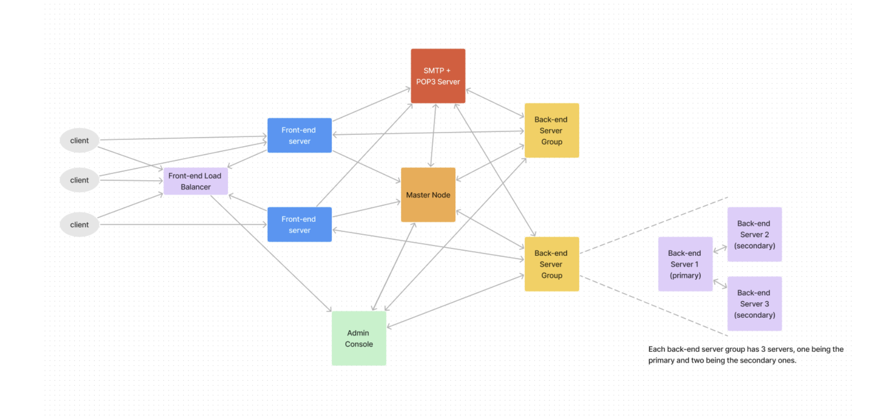

# Google Suite Copy — Webmail + Cloud Drive
*Gmail/Drive-style apps in one repo. Not affiliated with Google.*

---

## 🚀 Overview
This repository contains two production-style demo apps in a single codebase:
- **Webmail (Gmail-style):** compose, reply, forward; inbox listing & message view; external SMTP/POP bridge.
- **Cloud Drive (Google Drive-style):** folders/files, uploads/downloads (text & binary), simple browser UI.

Both apps share a distributed storage core and a minimal, fast front end. This is an educational/demo project and is **not affiliated with Google**.

---

## ⚡ Key Features

### ✉️ Webmail
- **Compose / Reply / Forward** with To/Cc/Bcc, subject, and message body.
- **Inbox list & message view** with pagination and basic search.
- **POP-style retrieval** (UIDL / RETR / DELE) + **SMTP send/receive** bridge.
- **Session cookies** for login persistence and multi-tab use.

### 🗂️ Cloud Drive
- **Folder & file operations** (create, rename, delete, move).
- **Uploads / downloads** (supports text & binary).
- **Chunk/base64 handling** for large or binary objects.
- **Quick preview** for common text formats.

### 🏗️ Shared Platform
- **KV-backed storage core** with **primary-replicated writes** for consistency.
- **Write-ahead logging + periodic checkpoints** for durability and fast recovery.
- **Stateless front ends** suitable for **horizontal scaling** behind a proxy/load-balancer.
- **Admin endpoints** for basic node health/actions (optional).

---

## 🛠️ Tech Stack
> Replace with your actual stack details if different.

- **Backend:** Java/Go/Node (HTTP APIs)
- **Storage:** Distributed KV store (+ write-ahead log & checkpoints)
- **Protocols:** SMTP (send), POP-style retrieval (UIDL/RETR/DELE)
- **Frontend:** HTML, CSS, JavaScript (no heavy frameworks)

---
